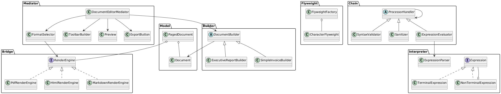

# Smart Document Engine - Pattern Integration

Academic project based on the **Pattern Integration** activity. It implements the six required Java design patterns inside a simple smart document engine.

## Patterns

- **Flyweight:** `FlyweightFactory` shares `CharacterFlyweight` instances and separates intrinsic state from coordinates, color, and scale.
- **Builder:** `DocumentBuilder`, `ExecutiveReportBuilder`, and `SimpleInvoiceBuilder` build the document step by step.
- **Bridge:** `PagedDocument` uses `RenderEngine` and can switch between PDF, HTML, and Markdown without changing the document abstraction.
- **Chain of Responsibility:** validates, sanitizes, and evaluates expressions before rendering.
- **Interpreter:** `TerminalExpression`, `NonTerminalExpression`, and `ExpressionParser` interpret formulas with variables and arithmetic operations.
- **Mediator:** `DocumentEditorMediator` coordinates the format selector, toolbar builder, preview, and export button without direct communication between components.

## Requirements

- JDK 17 or newer.

## Compile

From the project root:

```bash
javac -d out $(find src/main/java -name "*.java")
```

On Windows PowerShell:

```powershell
Get-ChildItem -Recurse src/main/java/*.java | ForEach-Object { $_.FullName } | Set-Content sources.txt
javac -d out @sources.txt
java -cp out com.company.documents.Main
```

## Run

```bash
java -cp out com.company.documents.Main
```

The `Main` class demonstrates configuration through the Mediator, document construction through the Builder, Flyweight reuse, Chain of Responsibility processing, Interpreter evaluation, and Bridge rendering in two formats.

## UML

The `diagrama.puml` file contains the complete class diagram. It can be opened with PlantUML or another compatible UML viewer.

## Test Result

The project was compiled with JDK and executed successfully. The final console message is:

```text
=== DEMO COMPLETED SUCCESSFULLY ===
```
